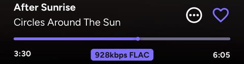

# @jellify-music/react-native-reanimated-slider

A performant, customizable slider component for React Native, powered by React Native Gesture Handler and Reanimated.



## Intro

We built this slider for [Jellify](https://github.com/Jellify-Music/App) to have an easily customizable and performant slider with minimal dependencies. Leveraging Reanimated and Gesture Handler, this library uses the modules you already know and love - and works instantly in your project.

## Features

- Smooth gesture handling with tap and pan support
- Powered by Reanimated for 60fps animations
- Fully customizable colors and shadows
- Works on iOS and Android

## Installation

```sh
npm install @jellify-music/react-native-reanimated-slider
# or
yarn add @jellify-music/react-native-reanimated-slider
# or
bun add @jellify-music/react-native-reanimated-slider
```

### Peer Dependencies

This library requires the following peer dependencies:

- `react-native-reanimated: "~4.1.0"`
- `react-native-gesture-handler: ">= 2.30.0"`

## Usage

```tsx
import Slider from '@jellify-music/react-native-reanimated-slider';
import { useSharedValue } from 'react-native-reanimated';

function MyComponent() {
  const progress = useSharedValue(0);

  return (
    <Slider
      value={progress}
      onValueChange={(value) => {
        console.log('Slider value:', value);
      }}
      maxValue={100}
      thumbWidth={24}
      trackHeight={8}
      backgroundColor="#e0e0e0"
      color="#6200ee"
      thumbShadowColor="#000"
    />
  );
}
```

## Props

| Prop | Type | Required | Description |
|------|------|----------|-------------|
| `value` | `SharedValue<number>` | ✓ | A Reanimated shared value that controls the slider position |
| `onValueChange` | `(value: number) => void` | ✓ | Callback fired when the user releases the slider |
| `maxValue` | `number` | ✓ | The maximum value of the slider |
| `thumbWidth` | `number` | ✓ | The width and height of the thumb (circular) |
| `trackHeight` | `number` | ✓ | The height of the track |
| `backgroundColor` | `string` | ✓ | The color of the background track |
| `color` | `string` | ✓ | The color of the progress track and thumb |
| `thumbShadowColor` | `string` | | The shadow color of the thumb |
| `gestureActiveRef` | `RefObject<boolean>` | | A `ref` indicating whether the slider is being used |
| `hitSlop` | `number` | | A [`hitSlop`](https://docs.swmansion.com/react-native-gesture-handler/docs/gestures/native-gesture/#hitslopsettings) value to apply to the slider |

## Example Project

To run the example project locally:

```sh
# Clone the repo
git clone https://github.com/Jellify-Music/react-native-animated-slider.git
cd react-native-animated-slider

# Install dependencies
bun install

# Navigate to the example folder
cd example

# Generate native projects
bun prebuild

# Run on iOS
bun ios

# Or run on Android
bun android
```

## License

MIT

---

Made with [create-react-native-library](https://github.com/callstack/react-native-builder-bob)
